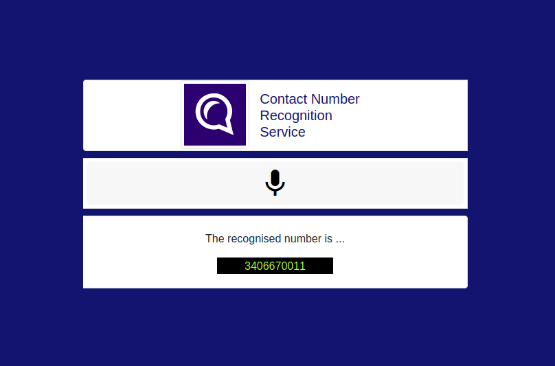

### Create the required environment

1. `conda env create -f environment.yml`

2. `conda activate ufo`

### Directory Structure

The directory contains the following folders:

* `data/`: contains some audio samples at `audio/`. The speech chunks get saved at `audio/` and MFCC images get saved at `images/`

* `speech_rec_pytorch/`: contains files to train a digit recognition model from scratch

* `pretrained_model/`: contains pretrained model. Replace with the model you want to use. I am using `speech_net_aug.pth.tar`.

* `static/` and `templates/`: For the Web App part

* `misc/`: Some utility functions

### Files

**To run the Web App:**
1. `export FLASK_APP=application.py` 
 
2. `flask run`. 

Then navigate to `http://127.0.0.1:5000/`.

**To run a simple demo**

`python demo.py -pn <file_name from audio/>`

### Demo

