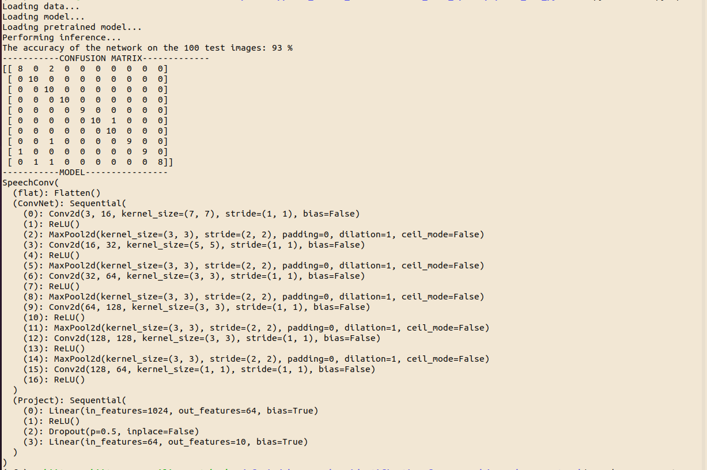

The directory is organised as follows:

### Folders
* The `data/` directory consists of two subfolders: train and test

  * `train/` contains 3400 images of MFCC extracted from spoken digit audio samples of 19 speakers. 

  * `test/` contains 100 images of MFCC extracted from spoken digit audio samples of 3 speakers. 

`data/` further contains `.json` files that store information about train and test data. 

To augment the datasets, simply add the images into the train and test directories and run `python read_dataset.py`.

* The `saved/` directory contains tensorboard logs at `log/`, saved models at `models/` and some metrics at `metrics/`.
          
### Files
* `dataloader.py`: to load the datasets for training and testing
* `model.py`: the model used for the purpose
* `train.py`: contains code for training the model
* `test.py`: contains code for testing the model
* `main.py`: run this file to train/test. All other files are called from within this file.

**To train the model**:

`python main.py -e 20 -tr t`

This will train the model on the data for 20 epochs and test it on the test data.

**To test the model:**

`python main.py -p t`

This will test the model using a pretrained model.

### Demo

